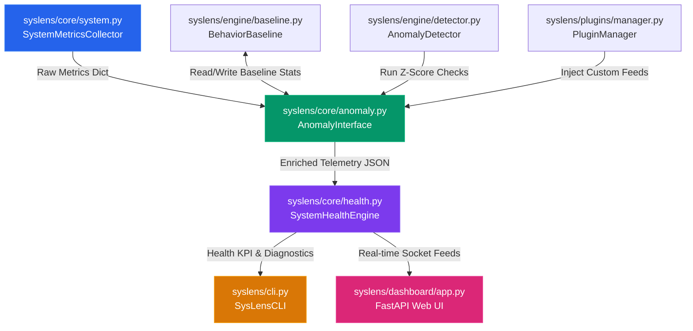

# 📐 Architecture Guide

This document describes the high-level architecture, module design, data flow, and behavioral algorithms utilized in SysLens.

---

## 🗺️ High-Level Component Design

SysLens separates metrics telemetry collection, behavioral learning, diagnostic evaluation, and interface presentations.

---

## 📂 Module Descriptions

### 1. Telemetry Collector (`syslens/core/system.py`)
Responsible for reading raw OS-level telemetry.
- Employs `psutil` to extract CPU core counts, clock frequencies, memory capacities, swap levels, and disk partition bounds.
- Compiles a list of top resource-consuming PIDs, filtering out system idle processes (e.g., PID 0 on Windows) to prevent false CPU spikes.

### 2. Behavioral Baseline (`syslens/engine/baseline.py`)
Models normal system behavior using a rolling statistic window.
- Persists running metrics to `~/.syslens/baseline.json`.
- Calculates mean (\(\mu\)) and standard deviation (\(\sigma\)) dynamically once a minimum historical threshold of samples (default: 10) is accumulated.

### 3. Anomaly Detector (`syslens/engine/detector.py`)
Computes Z-scores for incoming telemetry metrics against historical baseline statistics.
- **Z-Score Formula**:
  \[Z = \frac{x - \mu}{\sigma}\]
  Where:
  - \(x\) is the current telemetry metric value.
  - \(\mu\) is the baseline mean.
  - \(\sigma\) is the baseline standard deviation.
- **Severity Mapping**:
  - \(Z < 2.0\): normal telemetry profile.
  - \(2.0 \le Z < 3.0\): `LOW` severity warning.
  - \(3.0 \le Z < 4.5\): `MEDIUM` severity anomaly.
  - \(Z \ge 4.5\): `HIGH` severity spike.
- **Correlation Alerts**: Combines metrics (such as concurrent CPU spike and Memory limit degradation) to diagnose compound bottlenecks.

### 4. Health Engine (`syslens/core/health.py`)
Deducts penalty points from a perfect score of 100 based on resource utilization bounds and anomaly severities:
- **CPU penalty**: Max 30 points deducted.
- **Memory penalty**: Max 35 points deducted.
- **Disk penalty**: Max 15 points deducted.
- **Anomaly penalty**: Max 20 points deducted (with `HIGH` severity anomalies triggering immediate maximum deductions).
- **Classification**:
  - Score \(\ge 80.0\): `HEALTHY` (🟢)
  - \(50.0 \le \text{Score} < 80.0\): `DEGRADED` (🟡)
  - Score \(< 50.0\): `CRITICAL` (🔴)

### 5. Plugin Manager (`syslens/plugins/manager.py`)
Loads internal plugins (e.g. GPU telemetry checks using `nvidia-smi` and Battery status checks using `psutil`) and scans custom external plugins at runtime.

---

## 🔄 Live Data Flow

1. The **CLI** or **FastAPI server** ticks (at 0.5Hz or client demand).
2. The `SystemMetricsCollector` pulls raw metrics from the hardware.
3. The `PluginManager` executes all registered plugins, appending custom fields to the telemetry snapshot.
4. The `AnomalyInterface` updates the `BehaviorBaseline` file and executes the `AnomalyDetector`'s Z-score checks.
5. The `SystemHealthEngine` processes the snapshot, calculates the health score, and generates troubleshooting recommendations.
6. The compiled dashboard payload is returned via standard stdout formatting, rendered into terminal cells, or pushed to the web dashboard over a live WebSocket stream.
