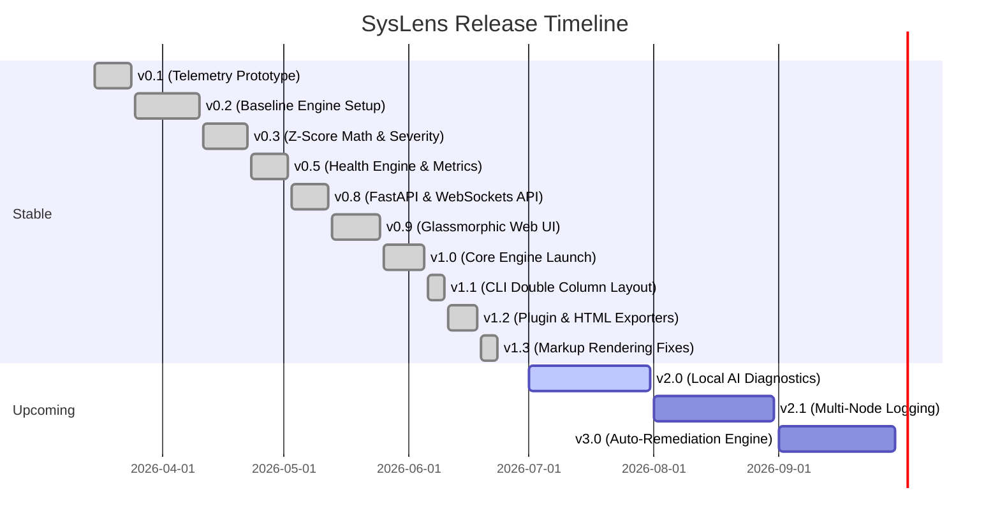

# 🛣️ SysLens Project Roadmap

This document outlines the version milestones, future goals, and planned feature roadmap for SysLens.

---

# 🗺️ Release Timeline

---

## 🎯 Milestones

### ✅ Milestone 1: Telemetry, Baseline & Anomaly Roots (v0.1.0 – v0.5.0 - Released)
- High-performance, low-overhead system metrics collector pulling CPU/RAM/Disk stats.
- Process utilization explorer to list and filter high-consuming PID lists.
- Baseline calculation engine using rolling statistical means and standard deviation JSON storage.
- Z-score deviation mathematics classifying anomaly severity (LOW, MEDIUM, HIGH).
- Health evaluation deductions logic and warnings notification structures.

### ✅ Milestone 2: Core Server & Web UI (v0.8.0 – v1.0.0 - Released)
- FastAPI local server backend hosting metrics REST endpoints.
- WebSocket server handles streaming real-time telemetry packets every second.
- Premium dark-glassmorphic frontend dashboard with animated Chart.js curves.
- Production package configuration (`pyproject.toml`, console scripts) and pytest coverage tests.

### ✅ Milestone 3: UI/UX & Plugins Integration (v1.1.0 – v1.3.0 - Released)
- Double-column console layouts for `syslens scan` and `syslens live` dashboards.
- Integrations for Battery status and GPU utilization (`nvidia-smi` parser + grace simulators).
- Automated CLI compatibility checks resolving unicode character crash behaviors on Windows.
- **Rich Markup Rendering Fix**: Separated styling from raw text buffers inside terminal `Text.append(...)` blocks to prevent unparsed brackets from displaying on the console.

### 🚀 Milestone 3: Local AI Root Cause Analysis (v2.0.0 - In Progress)
- Integrate a local, lightweight diagnostic model (e.g. Llama-3-8B-Instruct or Phi-3 via ONNX Runtime / local endpoints) to evaluate active processes and anomaly logs.
- Provide human-readable summaries explaining *why* a CPU spike or memory leak occurred and suggesting remediation scripts.
- Toggle local AI inference off/on via `pyproject.toml` or environment variables to preserve memory.

### 🌐 Milestone 4: Multi-Node Observation (v2.1.0 - Planned)
- Implement a decentralized telemetry agent that can be deployed on multiple remote server nodes.
- Remote nodes will forward telemetry summaries to a single centralized SysLens FastAPI backend.
- The glassmorphism Web UI will be updated with a node selection sidebar allowing real-time switching between connected servers.

### 🛡️ Milestone 5: Automated Self-Healing (v3.0.0 - Planned)
- Enable rule-based triggers that can invoke automated shell scripts or rollback commands on critical anomalies (e.g. killing zombie processes, cleaning log cache, restarting system services).
- Prompt the user with OS notifications to approve/deny self-healing steps, keeping a complete audit log of executed remediations.
